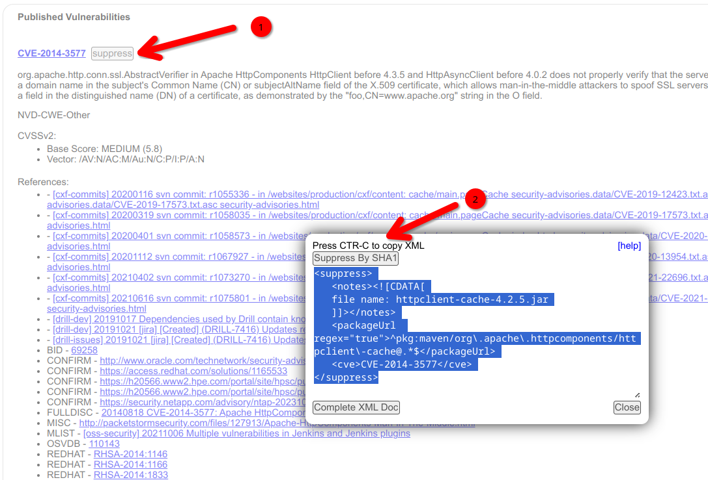

# OWASP CVE suppression of false positives

**_Only do this if you are sure the CVE is a false positive and is no risk to the organisation!_**

You might want to use one of these resources to decide the severity of the CVE and what action to take:
* https://nvd.nist.gov/vuln
* https://www.cve.org[](https://cve.mitre.org)
* https://ossindex.sonatype.org/
* https://ossindex.sonatype.org/vulnerability/CVE-2022-31159
* https://owasp.org/www-project-dependency-check/

Also, [this page contains a full explanation](https://jeremylong.github.io/DependencyCheck/general/suppression.html)
of how to suppress false positives; here is a summary:

1) **Run OWASP Maven goal**: Run this for your project, it should fail:

```shell
mvn dependency-check:check
```

2) Although it will have failed it will have generated a report in the target folder of the
   project: `target/dependency-check-report.html`.

3) Open the HTML report.

4) **Copy the XML snippet**: The XML snippet can be found by clicking the (1) `suppress` button next to the CVE in the
   report. A dialog opens, use (2) Control-C to copy the
   snippet.



5) Here is another example of an XML snippet:

```xml

<suppress>
    <notes><![CDATA[
   file name: woodstox-core-6.5.1.jar
   ]]></notes>
    <packageUrl regex="true">^pkg:maven/com\.sun\.xml\.bind\.jaxb/isorelax@.*$</packageUrl>
    <cve>CVE-2023-34411</cve>
</suppress>
```

6) **Open the supressions XML file**: Edit this
   file [src/main/resources/owasp-suppressions.xml](src/main/resources/owasp-suppressions.xml).

7) **Paste the snippet**: The XML snippet can be pasted to the end of the file **_before_** the `</suppressions>` end
   tag.

8) **Update pom.xml versions**:  You need to make 3 changes.
    1. Update this project's version by editing the [pom.xml](pom.xml) and increasing the `<version>` tag accordingly.
    2. In [snomed-parent-bom's pom.xml](https://github.com/IHTSDO/snomed-parent-bom/blob/main/pom.xml) find this
       tag `<snomed-parent-owasp.version>` near the top of the file. And set the version to the same as you used in the
       previous step.
    3. **_Optional_**: While editing
       the [snomed-parent-bom's pom.xml](https://github.com/IHTSDO/snomed-parent-bom/blob/main/pom.xml)
       also increase its `<version>`.
